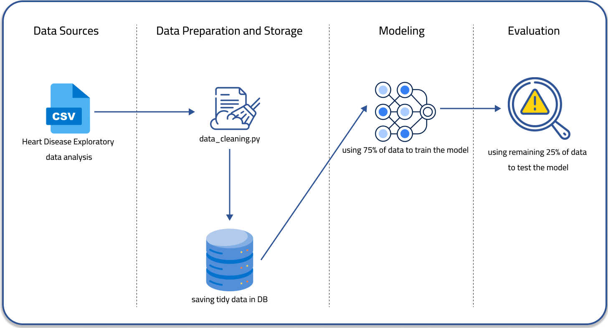

# DSA Projekt
Dies ist ein Repository, welches für ein Projekt zur Prävention von Herz-Kreislauf-Erkrankungen des Moduls "Data Science and Analytics", genutzt wird.
Das Ziel ist es hierbei eine Präventionsstrategie für Herzkrankheiten zu entwickeln, die mit hoher Genauigkeit eine mögliche Erkrankung hervorsagen und die genauen Risikofaktoren analysieren kann.

# Inhaltsverzeichnis
1. [Repo-Navigation](#Repo-Navigation)
    1. [Übersicht](#Uebersicht)
    2. [Installationsanleitung](#Installationsanleitung)
2. [Projektbeschreibung](#Projektbeschreibung)
3. [Mögliche Lösungen für das Problem](#Mögliche-Lösungen-für-das-Problem)
3. [Parameterbewertung](#Parameterbewertung)
    1. [Auswahl der Datenquelle](#Auswahl-der-Datenquelle)
    2. [Parameterübersicht](#Parameterubersicht)
    3. [Manuelle Bewertung](#Manuelle-Bewertung)
    4. [PCA](#PCA)
    5. [Fazit](#Fazit)
4. [Architektur-Diagramm](#Architektur-Diagramm)
5. [Genutztes statistisches Modell](#Genutztes-statistisches-Modell)

# Repo-Navigation

## Übersicht
In unserem Repository sind 3 Überordner zu finden:
-  docs
Der  "docs"-Ordner wird für jegliche Dokumentation, die im Laufe des Projekts anfällt, genutzt. Aktuell befinden sich dort zum Einen die Projektskizze, die das Projekt beschreibt und die Ziele definiert, diese soll jedoch im Verlauf des Projekts von dieser README-Datei ersetzt werden. Zum Anderen ist dort auch eine HTML-Datei zu finden, die sämtliche Graphen, Code und Erklärungen zu dem Hauptdatensatz enthalten, um die Informationen auch ohne clonen des Repos einsehen zu können. Dafür muss diese lediglich gedownloaded und dann geöffnet werden. Zuletzt befindet sich hier auch noch eine "requirements"-Datei, in der sich alle Libraries, die benötigt werden, befinden.
-  resources
Hier befinden sich momentan zwei Datensätze, jeweils als bereinigte und unbereinigte Version, die wir als Basis für das Projekt nutzen.
Einer dieser Datensätze wird aktiv genutzt, während der andere, nämlich "heart_predictions.csv" verworfen wurde, da zu wenige Observations vorliegen, um ein zuverlässiges Modell zu erstellen.
-  scripts
In diesem Ordner befinden sich sämtliche Skripte des Projekts.
Unter Anderem sind hier die Datenbereinigung und -Speicherung, namens "data_cleaning_and_save.py" zu finden.
Weiterhin liegt hier auch das Skript "Heart_2020_exploration_Visualization.ipynb, welches für die leichtere Lesbarkeit in Form eines Jupyter-Notebooks vorliegt. In diesem Skript sind sämtliche Graphen und Informationen zu finden, die dann daraus in die PDF in dem "docs"-Ordner exportiert wurden.
Zuletzt liegt hier das Skript "pca_heart2020.py", in der der Datensatz nach den Hauptkomponenten analysiert wird.
- deprecated
In diesem Ordner befinden sich sämtliche Skripte und Dateien, die im Verlauf des Projekts genutzt worden sind, jedoch inzwischen nicht mehr relevant sind.

## Installationsanleitung
**Voraussetzungen:**
* Python Version 3.11.9
* Jupyter Version 6.5.4

**Installation:**
1. Klonen Sie das Repository:
```bash
git clone https://github.com/dj0910/DSA_Project.git
```
2. Navigieren Sie zum Order
```bash
cd DSA_Project
```
3. Installieren Sie alle benötigten Packages
```bash
pip install -r docs/requirements.txt
```

# Projektbeschreibung 
Im Rahmen des Wahlpflichtmoduls Data Science and Analytics an der Hochschule Mannheim beschäfigen wir uns als Team Data Dazzlers, bestehend aus fünf Studierenden, intensiv mit dem Thema der Prävention von Herzkrankheiten. Diese Krankheiten zählen weltweit zu den führenden Todesursachen, wobei laut Angaben der Weltgesundheitsorganisation (WHO) bis zu 18 Millionen[<sup>1</sup>](https://www.who.int/news-room/fact-sheets/detail/cardiovascular-diseases-(cvds)) Menschen jährlich an ihnen sterben. In Deutschland allein sind jährlich etwa 350.000 Todesfälle[<sup>2</sup>](https://www.destatis.de/DE/Themen/Gesellschaft-Umwelt/Gesundheit/Todesursachen/_inhalt.html) aufgrund von Herz-Kreislauf-Erkrankungen zu verzeichnen, wie durch das statistische Bundesamt belegt wird. 
Die Prävention dieser Erkrankungen spielt eine entscheidende Rolle im Gesundheitsmanagement. Hierbei kommen moderne Technologien und insbesondere Wearables wie Smartwatches ins Spiel. Diese ermöglichen es einem Individuum, seine Gesundheitsdaten kontinuierlich zu messen und auf Grundlage dieser Informationen entsprechend zu handeln. 
Das Team Data Dazzlers konzentriert sich darauf, eine Präventionsstrategie für Herzkrankheiten zu entwickeln und zu optimieren. Ein zentraler Ansatzpunkt dabei ist die Untersuchung 
physikalischer Risikofaktoren, die durch Wearables messbar sind. Durch die Analyse und Auswertung dieser Daten können frühzeitig potenzielle Risiken erkannt und präventive Maßnahmen eingeleitet werden. Hierbei kommt modernste Data-Science-Technologie zum Einsatz, um die Zusammenhänge zwischen den gemessenen physikalischen Parametern und dem Risiko für Herzkrankheiten zu erforschen und zu verstehen. Das Ziel ist es, präzise und individualisierte Empfehlungen für die Gesundheitsvorsorge zu entwickeln, die auf den individuellen Risikoprofilen der Nutzer basieren.

# Mögliche Lösungen für das Problem
**1. Prävention und Früherkennung von Herz-Kreislauf-Erkrankungen**
Für die Prävention und Früherkennung von Herz-Kreislauf-Erkrankungen nutzen wir ein innovatives Machine-Learning-Konzept, das auf wissenschaftlichen Datensätzen basiert. Diese Datensätze umfassen Informationen über Risikofaktoren, Krankheitsverläufe und Präventionsstrategien. Mit Hilfe von Machine-Learning analysieren wir diese Daten, um Muster und Zusammenhänge zu identifizieren, die auf ein erhöhtes Risiko für Herz-Kreislauf-Erkrankungen hinweisen können.
Der Algorithmus funktioniert wie ein Punktesystem, welches das individuelle Risiko einer Person für Herz-Kreislauf-Erkrankungen bewertet. Dieses System vergibt auf Basis der Trainingsdaten sowie der persönlichen Daten des Nutzers Punkte. Durch die Bewertung verschiedener Risikofaktoren wird ein Gesamtrisikowert ermittelt, der anzeigt, wie hoch die Wahrscheinlichkeit ist, dass eine Person in der Gegenwart, oder womöglich in der Zukunft an einer Herz-Kreislauf-Erkrankung leiden könnte.
Gleichzeitig können mithilfe von Wearables kontinuierlich Vitalwerte wie Herzfrequenz, Blutdruck und Aktivitätsniveau von Personen erfasst werden. Diese Daten werden in Echtzeit erfasst und könnten mit unserem Machine-Learning-Modell analysiert werden. Auf Grundlage dieser Analyse werden personalisierte Empfehlungen zur Verbesserung des Lebensstils und zur Prävention von Herz-Kreislauf-Erkrankungen generiert.
Diese Empfehlungen können je nach Umsetzbarkeit von den Betroffenen selbst oder mithilfe des eigenen behandelnden Arztes realisiert werden. So können Betroffene aktiv ihren Lebensstil anpassen und gesundheitsschädigende Verhaltensmuster vermeiden. Diese proaktive Herangehensweise ermöglicht es, Herz-Kreislauf-Erkrankungen effektiv zu verhindern oder zumindest ihre Entwicklung zu verlangsamen.

**2. Vermeidung/Aufklärung von Volkskrankheiten**
Das Gesundheitssystem konzentriert sich immer mehr auf die kurative, sprich die heilende, als auf die präventive, sprich vorbeugende Medizin[<sup>3</sup>](https://www.pedocs.de/frontdoor.php?source_opus=10361). Dadurch erkranken Menschen, die durch präventive Maßnahmen eigentlich nicht erkranken hätten müssen.
Durch Projekte, die sich auf die Prävention von Krankheiten konzentrieren, kann also nicht nur dem Einzelnen geholfen werden, ein gesünderes und krankheitsfreies Leben zu führen, sondern auch der Bevölkerung als Gemeinschaft. Denn vor allem Volkskrankheiten, wie Diabetes, Adipositas und Herz-Kreislauf-Erkrankungen belasten nicht nur die Betroffenen, sondern auch unser Gesundheitssystem massiv[<sup>4</sup>](https://www.uni-paderborn.de/fileadmin/psychisch-stark-am-arbeitsplatz/pdf/BDP-Bericht-2012.pdf), denn diese Erkrankungen sind meist nur der Anfang, auf den dann Folgeerkrankungen oder Sekundärerkrankungen folgen, durch die die Menschen noch kränker werden.

**3. Sensibilisierung des Bewusstseins für die eigene Gesundheit**
Dadurch, dass man in Arztpraxen nur noch schwer Termine bekommt und die Ärzte, wenn man dann mal einen Termin hat, unter massivem Zeitdruck stehen, fühlen sich viele Menschen im Gesundheitssystem übersehen und auch allein gelassen mit ihren Fragen und Sorgen.
Durch Projekte wie diese, bei denen Betroffene auf einfache und bequeme Art und Weise einen Überblick über die eigene Gesundheit erhalten können, wird ihnen die Angst genommen und auch eine Richtung vorgegeben, an der sie sich orientieren können. Es kann sich sehr befreiend und stärkend anfühlen, die Kontrolle über die eigene Gesundheit zu haben und nicht auf fremde Hilfe angewiesen zu sein. Durch die Einfachheit solcher Anwendungen und die einfache Integration in den Alltag der Menschen beschäftigen sich diese wahrscheinlich mehr und auch lieber mit ihrer Gesundheit, als wenn solche Projekte nicht existieren würden und dadurch wird eine allgemein gesündere Bevölkerung angestrebt und gefördert.

# Projektziele
**a. Grundlegende Prävention von Herzkreislauferkrankungen**
Das Ziel ist es, eine ganzheitliche und effektive Präventionsstrategie für Herz-Kreislauf-Erkrankungen zu entwickeln. Dabei sollen nicht nur Risikofaktoren identifiziert und adressiert werden, sondern auch Maßnahmen zur Förderung eines gesunden Lebensstils und zur Reduzierung von Risikoverhalten ergriffen werden. Die Präventionsstrategie soll sowohl auf individueller Ebene als auch auf der Ebene der Gemeinschaft und der öffentlichen Gesundheit wirksam sein. Es sollen evidenzbasierte Interventionen entwickelt werden, die auf den spezifischen Bedürfnissen und Risikoprofilen der Zielgruppen basieren.

**b. Bewertung der Aussagekraft von Wearables in Bezug auf Prävention von Herz-Kreislauf-Erkrankungen**
Das Ziel ist es, die Wirksamkeit und Zuverlässigkeit von Wearables zur Prävention von Herz-Kreislauf-Erkrankungen zu untersuchen und zu bewerten. Dabei sollen verschiedene Arten von Wearables, wie Smartwatches und Fitness-Tracker, auf ihre Eignung hin analysiert werden, relevante Gesundheitsdaten zu erfassen und präventive Maßnahmen zu unterstützen.

**c. Top 2-3 Risikofaktoren ausgeben**
Das Ziel ist es, die wichtigsten Risikofaktoren für den Betroffenen zu identifizieren. Durch umfassende Datenanalysen und Machine-Learning-Modelle sollen die Risikofaktoren ermittelt werden, die den größten Einfluss auf die mögliche Entstehung und Entwicklung einer Herz-Kreislauf-Erkrankung haben. Dadurch kann der Betroffene sich gezielt auf diese Faktoren konzentrieren und ihnen entgegenwirken.

**d. Verlaufskurve für das weitere Risiko**
Das Ziel ist es, eine prognostische Risikokurve für die zukünftige Entwicklung des Risikos von Herz-Kreislauf-Erkrankungen zu erstellen. Durch die Integration von historischen Gesundheitsdaten, aktuellen Gesundheitswerten und prädiktiven Modellen sollen individuelle
Risikoprofile erstellt werden.
Diese Risikokurven sollen kontinuierlich aktualisiert und verfeinert werden, um zu zeigen, wie sich Verbesserungen oder Verschlechterungen der Risikofaktoren auf den Verlauf des Gesamtrisikos über die Zeit auswirken.

# SMART-Ziele 
- **Spezifisch:** Ein Algorithmus soll mit hoher Wahrscheinlichkeit das Risiko, an einer Herz-Kreislauf-Erkrankung zu erkranken, vorhersagen können, wenn ihm die letzten 4 Wochen an Daten 
eines Nutzers vorliegen. 
- **Messbar:** Die Anzahl der gemiedenen Herz-Kreislauf-Erkrankungen soll gemessen werden. Ent-
weder indem bereits Erkrankte ihre Daten bis zum Zeitpunkt der Erkrankung in das Modell 
einspielen und testen, ob ein hohes Risiko ausgegeben wird, oder indem Risikobewertungen, 
die das Modell ausgegeben hat, nachverfolgt werden. 
- **Attraktiv:** Nutzer haben mehr Kontrolle über die eigene Gesundheit und können diese leichter 
steuern und überwachen. 
- **Realistisch:** Die Ziele des Projekts sind mit den vorhandenen Ressourcen erreichbar, da das 
gesamte Semester an Zeit zur Verfügung steht und der Umfang des Projekts flexibel angepasst 
werden kann, indem Must-haves, wie eine Risikobewertung und Nice-to-haves, wie eine Risi-
kokurve, eine GUI, etc. definiert wurden. 
- **Terminiert:** Das Projekt endet mit Abschluss des Moduls Data Science and Analytics.

# Parameterbewertung

## Auswahl der Datenquelle
Die Entscheidung über die Datenquellen orientierte sich an der „Checkliste für Datenakquise“ und es war wichtig, eine Mischung aus primären und sekundären Datenquellen zu erhalten. 
Leider gestaltete sich der Zugriff auf medizinische Daten schwierig, wodurch die Auswahl der Datensätze generell sehr eingeschränkt war. 
Dabei wurde berücksichtigt, möglichst viele Attribute in den Datensätzen zu haben, um viele Risikofaktoren einzubeziehen und unterschiedlich gewichten zu können. Es war auch wichtig, keine leeren Beobachtungen in den Datensätzen zu haben, da sie den Datensatz verunreinigen können.  
Auch ein Bias kann einen Datensatz verunreinigen, jedoch war es schwierig, Bias vollständig zu vermeiden. Im ausgewählten Datensatz gibt es einen Response-Bias, da es sich um eine Befragung handelt und nicht um wissenschaftlich erhobene Daten. 
Dieser Bias tritt auf, wenn die Antworten in einer Umfrage oder Studie systematisch von bestimmten Faktoren beeinflusst werden, was zu einer Verzerrung der Ergebnisse führen kann. 
In diesem Fall könnten persönliche Fragen zur sportlichen Aktivität, zum Gewicht und anderen Gewohnheiten die Befragten dazu bringen, unehrlich zu antworten und somit zu einem Response-Bias führen.  
Obwohl der Datensatz einen gewissen Bias aufweist, wurde er aufgrund seiner Aktualität (2023), seines Umfangs (über 300.000 Einträge) und der Vielzahl interessanter und gut messbarer Attribute ausgewählt.

## Parameterübersicht
Hier sind alle vorhandenen Parameter aufgelistet.
| Parametername  | Datenart      |
| :-------------:  |:-------------:|
| Herzerkrankung       | Kategoriell     |
| BMI       | Nummerisch     |
| Rauchen       | Kategoriell     |
|Alkoholkonsum|Kategoriell|
|Schlaganfall|Kategoriell|
|physische Gesundheit|Numerisch|
|mentale Gesundheit|Numerisch|
|Schwierigkeiten beim Laufen|Kategoriell|
|Geschlecht|Kategoriell|
|Alterskategorie|Kategoriell|
|Ethnie|Kategoriell|
|Diabetes|Kategoriell|
|physische Aktivität|Kategoriell|
|generelle Gesundheit|Kategoriell|
|Schlafdauer|Numerisch|
|Asthma|Kategoriell|
|Nierenerkrankung|Kategoriell|
|Hautkrebs|Kategoriell|
## Manuelle Bewertung
Diese Parameter wurden durch die Datenalayse und -visualisierung manuell als relevante Risikofaktoren eingestuft.
| Parametername  | Datenart      |
| :-------------:  |:-------------:|
| Alterkategorie       | Kategoriell     |
| Schlafdauer       | Nummerisch     |
| Nierenerkrankung       | Kategoriell     |
|generelle Gesundheit|Kategoriell|
|Schlaganfall|Kategoriell|

## PCA
Die PCA-Bewertung wurde vorbereitet und das Skript wurde geschrieben, allerdings steht hier die genaue Auswertung und das Fine-Tuning noch aus, weswegen hierzu noch keine abschließende Aussage getroffen werden kann. Dies wird jedoch als nächster Schritt im Projekt anvisiert. Hauptsächlich soll PCA genutzt werden, um die manuelle Bewertung der Attribute (s.o.) zu bestätigen oder zu widerlegen.

## Fazit
Im folgenden wird ein vorläufiges Fazit gezogen, da ein endgültiges Fazit erst mit dem Ende des Projekts gezogen werden kann.
Weiterhin fehlen zur Endbewertung auch noch andere Konkurrenzmodelle zur logistischen Regression die vielleicht noch erprobt werden und die Bewertung mithilfe der PCA.
Mit den aktuellen Parametern Alterskategorie, Schlafdauer, Nierenerkrankung, generelle Gesundheit und Schlaganfall, die momentan die wichtigsten Paramter zur Berechnung des Risikos darstellen kann man bereits jetzt einen Rückschluss zu den Projektzielen ziehen.
Der wichtigste Punkt die einem hierbei ins Auge springt, ist, dass es immer Parameter geben wird, die nicht von Wearables oder Smartwatches gemessen werden können. Dadurch ist bereits jetzt ersichtlich, dass zusätzlich zu den Smartwatch-Paramtern noch eine Art Fragebogen existieren muss, mit dem der Betroffenen in Regelmäßigen Abständen befragt werden muss, allerdings kann diese Befragung über eine Anwendung der Smartwatch ablaufen, damit nicht noch ein zusätzliches Gerät von Nöten ist.
Zu diesen Parameter zählen bislang die Alterskategorie, die Nierenerkrankung, der Schlaganfall und die genrelle Gesundheit.
Die Schlafdauer jedoch könnte über die Smartwatch gesteuert und dokumentiert werden.
Damit wäre man in der Lage, durch dieselbe Anwendung, die auch die regelmäßigen Fragebögen steuert das Risiko berechnen zu lassen und damit die Projektziele größtenteils zu erfüllen.
Zum einen wird dadurch die Prävention und Früherkennung von Herz-Kreislauf-Erkrankungen gefördert, denn Alarmfunktionen bei zu hohem Risiko würden den Nutzer warnen, dass sein Risiko erhöht ist und ihn Aufforderung bewusst darauf zu achten und möglicherweise ärztliche Beratung aufzusuchen.
Dadurch wird der Nutzer automatisch für die eigene Gesundheit sensibilisiert und es werden indirekt auch Volkskrankheiten vermieden.

# Architektur-Diagramm
In diesem Data-Science-Projekt zur Prävention von Herz-Kreislauf-Erkrankungen durchlaufen wir folgende Schritte: 
1. Zunächst werden die Gesundheitsdaten aus der CSV-Datei gesammelt und in ein geeignetes Format überführt. (Im Diagramm sind noch 2 CSV-Dateien dargestellt, eine davon wurde aber aufgrund von nicht zielführeden Attributen verworfen)
2. Anschließend werden die Daten auf fehlende Werte und Ausreißer überprüft und nötige Korrekturen und TransformaƟonen vorgenommen. Die gesäuberten Daten werden zusätzlich abgespeichert. Um die spätere Modellbewertung zu ermöglichen, werden die Daten in Trainings- und Testdatensätze aufgeteilt. 
3. Mit den vorbereiteten Trainingsdaten trainieren wir ein Machine-Learning-Modell. Verschiedene Modelle können verglichen und dasjenige mit der besten Leistung ausgewählt werden. 
4. Das ausgewählte Modell wird anhand des Testdatensatzes evaluiert, um seine allgemeine Vorhersagegenauigkeit zu bestimmen. Geeignete Metriken werden verwendet, um die Modellleistung zu quantifizieren. 
5. Basierend auf den Ergebnissen des Modells interpretieren wir die Zusammenhänge zwischen den Risikofaktoren und der Erkrankungswahrscheinlichkeit. Das Modell kann dann eingesetzt werden, um neue Daten vorherzusagen oder weiterführende Erkenntnisse zu gewinnen.  



# Genutztes statistisches Modell
Als statistisches Modell wird die logistische Regression genutzt. Es wurde sich für dieses Modell entschieden, da der Großteil der Daten kategoriell ist und somit viele der im Unterricht vorgestellten Modelle nicht mehr mit den vorliegenden Daten zu vereinen waren.
Allerdings wurde sich noch nicht fest auf die logistische Regression geeinigt und im Verlauf des Projekts kann es durchaus sein, dass auch alternative Modelle noch betrachtet werden, vor Allem wenn die Ergebnisse mit der logistischen Regression nicht die gewünschte Genauigkeit erbringen.
