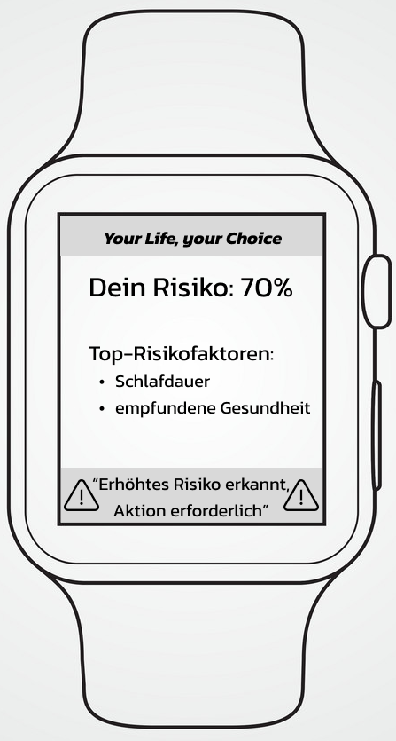

# DSA Projekt
Dies ist ein Repository, das für ein Projekt zur Prävention von Herz-Kreislauf-Erkrankungen im Rahmen des Moduls "Data Science and Analytics" genutzt wird.
Das Ziel ist es hierbei eine Präventionsstrategie für Herzkrankheiten zu entwickeln, die mit hoher Genauigkeit eine mögliche Erkrankung hervorsagen und die genauen Risikofaktoren analysieren kann.

# Inhaltsverzeichnis
1. [Repo-Navigation](#Repo-Navigation)
    1. [Übersicht](#Uebersicht)
    2. [Installationsanleitung](#Installationsanleitung)
2. [Projektbeschreibung](#Projektbeschreibung)
3. [Mögliche Lösungen für das Problem](#Mögliche-Lösungen-für-das-Problem)
4. [Projektziele](#Projektziele)
5. [Auswahl der Datenquelle](#Auswahl-der-Datenquelle)
    1. [Beschreibung der Datenquelle](#beschreibung-der-datenquelle)
6. [Parameterbewertung](#Parameterbewertung)
    1. [Parameterübersicht](#Parameterubersicht)
    2. [Manuelle Bewertung](#Manuelle-Bewertung)
    3. [PCA](#PCA)
    4. [Parameter-Fazit](#Parameter-Fazit)
7. [Architektur-Diagramm](#Architektur-Diagramm)
8. [Genutztes statistisches Modell](#Genutztes-statistisches-Modell)
9. [Haftungsausschluss](#Haftungsausschluss)
10. [Grenzen des Modells](#grenzen-des-modells)
11. [Fazit](#Fazit)
12. [Ausblick](#Ausblick)

# Repo-Navigation

## Übersicht
In unserem Repository sind 4 Überordner zu finden:
-  **docs**  
Der  "docs"-Ordner wird für jegliche Dokumentation, die im Laufe des Projekts anfällt, genutzt. Aktuell befinden sich dort zum einen die Projektskizze, die das Projekt beschreibt und die Ziele definiert, diese soll jedoch im Verlauf des Projekts von dieser README-Datei ersetzt werden. Zum Anderen ist dort auch eine HTML-Datei zu finden, die sämtliche Graphen, Code und Erklärungen zu dem Hauptdatensatz enthalten, um die Informationen auch ohne Clonen des Repos einsehen zu können. Dafür muss diese lediglich gedownloaded und dann geöffnet werden. Zuletzt befindet sich hier auch noch eine "requirements"-Datei, in der sich alle Libraries, die benötigt werden, befinden.
-  **resources**  
Hier befinden sich momentan zwei Datensätze, jeweils als bereinigte und unbereinigte Version, die wir als Basis für das Projekt nutzen.
Einer dieser Datensätze wird aktiv genutzt, während der andere, nämlich "heart_predictions.csv" verworfen wurde, da zu wenige Observations vorliegen, um ein zuverlässiges Modell zu erstellen.
-  **scripts**  
In diesem Ordner befinden sich sämtliche Skripte des Projekts.
Unter Anderem sind hier die Datenbereinigung und -Speicherung, namens "data_cleaning_and_save.py" zu finden.
Weiterhin liegt hier auch das Skript "Heart_2020_exploration_Visualization.ipynb, welches für die leichtere Lesbarkeit in Form eines Jupyter-Notebooks vorliegt. In diesem Skript sind sämtliche Graphen und Informationen zu finden, die dann daraus in die PDF in dem "docs"-Ordner exportiert wurden.
Zuletzt liegt hier das Skript "pca_heart2020.py", in der der Datensatz nach den Hauptkomponenten analysiert wird.
- **deprecated**  
In diesem Ordner befinden sich sämtliche Skripte und Dateien, die im Verlauf des Projekts genutzt worden sind, jedoch inzwischen nicht mehr relevant sind.

## Installationsanleitung
**Voraussetzungen:**
* Python Version 3.11.9
* Jupyter Version 6.5.4

**Installation:**
1. Klonen Sie das Repository:
```bash
git clone https://github.com/dj0910/DSA_Project.git
```
2. Navigieren Sie zu folgendem Ordner
```bash
cd DSA_Project
```
3. Installieren Sie alle benötigten Packages
```bash
pip install -r docs/requirements.txt
```

# Projektbeschreibung 
Im Rahmen des Wahlpflichtmoduls Data Science and Analytics an der Hochschule Mannheim beschäftigen wir uns als Team Data Dazzlers, bestehend aus vier Studierenden, intensiv mit dem Thema der Prävention von Herzkrankheiten. Diese Krankheiten zählen weltweit zu den führenden Todesursachen, wobei laut Angaben der Weltgesundheitsorganisation (WHO) bis zu 18 Millionen[<sup>1</sup>](https://www.who.int/news-room/fact-sheets/detail/cardiovascular-diseases-(cvds)) Menschen jährlich an ihnen sterben. In Deutschland allein sind jährlich etwa 350.000 Todesfälle[<sup>2</sup>](https://www.destatis.de/DE/Themen/Gesellschaft-Umwelt/Gesundheit/Todesursachen/_inhalt.html) aufgrund von Herz-Kreislauf-Erkrankungen zu verzeichnen, wie durch das statistische Bundesamt belegt wird.  
Die Prävention dieser Erkrankungen spielt eine entscheidende Rolle im Gesundheitsmanagement. Hierbei kommen moderne Technologien und insbesondere Wearables wie Smartwatches ins Spiel. Diese ermöglichen es einem Individuum, seine Gesundheitsdaten kontinuierlich zu messen und auf Grundlage dieser Informationen entsprechend zu handeln.  
Das Team Data Dazzlers konzentriert sich darauf, eine Präventionsstrategie für Herzkrankheiten zu entwickeln und zu optimieren. Ein zentraler Ansatzpunkt dabei ist die Untersuchung physikalischer Risikofaktoren, die durch Wearables messbar sind. Durch die Analyse und Auswertung dieser Daten können frühzeitig potenzielle Risiken erkannt und präventive Maßnahmen eingeleitet werden. Hierbei kommt modernste Data-Science-Technologie zum Einsatz, um die Zusammenhänge zwischen den gemessenen physikalischen Parametern und dem Risiko für Herzkrankheiten zu erforschen und zu verstehen. Das Ziel ist es, präzise und individualisierte Empfehlungen für die Gesundheitsvorsorge zu entwickeln, die auf den individuellen Risikoprofilen der Nutzer basieren.

# Mögliche Lösungen für das Problem
**1. Prävention und Früherkennung von Herz-Kreislauf-Erkrankungen**  
Für die Prävention und Früherkennung von Herz-Kreislauf-Erkrankungen nutzen wir ein innovatives Machine-Learning-Konzept, das auf wissenschaftlichen Datensätzen basiert. Diese Datensätze umfassen Informationen über Risikofaktoren, Krankheitsverläufe und Präventionsstrategien. Mit Hilfe von Machine-Learning analysieren wir diese Daten, um Muster und Zusammenhänge zu identifizieren, die auf ein erhöhtes Risiko für Herz-Kreislauf-Erkrankungen hinweisen können.  
Der Algorithmus funktioniert wie ein Punktesystem, welches das individuelle Risiko einer Person für Herz-Kreislauf-Erkrankungen bewertet. Dieses System vergibt auf Basis der Trainingsdaten sowie der persönlichen Daten des Nutzers Punkte. Durch die Bewertung verschiedener Risikofaktoren wird ein Gesamtrisikowert ermittelt, der anzeigt, wie hoch die Wahrscheinlichkeit ist, dass eine Person in der Gegenwart, oder womöglich in der Zukunft an einer Herz-Kreislauf-Erkrankung leiden könnte.  
Gleichzeitig können mithilfe von Wearables kontinuierlich Vitalwerte wie Herzfrequenz, Blutdruck und Aktivitätsniveau von Personen erfasst werden. Diese Daten werden in Echtzeit erfasst und könnten mit unserem Machine-Learning-Modell analysiert werden. Auf Grundlage dieser Analyse werden personalisierte Empfehlungen zur Verbesserung des Lebensstils und zur Prävention von Herz-Kreislauf-Erkrankungen generiert.  
Diese Empfehlungen können je nach Umsetzbarkeit von den Betroffenen selbst oder mithilfe des eigenen behandelnden Arztes realisiert werden. So können Betroffene aktiv ihren Lebensstil anpassen und gesundheitsschädigende Verhaltensmuster vermeiden. Diese proaktive Herangehensweise ermöglicht es, Herz-Kreislauf-Erkrankungen effektiv zu verhindern oder zumindest ihre Entwicklung zu verlangsamen.

**2. Vermeidung/Aufklärung von Volkskrankheiten**  
Das Gesundheitssystem konzentriert sich immer mehr auf die kurative, sprich die heilende, als auf die präventive, sprich vorbeugende Medizin[<sup>3</sup>](https://www.pedocs.de/frontdoor.php?source_opus=10361). Dadurch erkranken Menschen, die durch präventive Maßnahmen eigentlich nicht erkranken hätten müssen.  
Durch Projekte, die sich auf die Prävention von Krankheiten konzentrieren, kann also nicht nur dem Einzelnen geholfen werden, ein gesünderes und krankheitsfreies Leben zu führen, sondern auch der Bevölkerung als Gemeinschaft. Denn vor allem Volkskrankheiten, wie Diabetes, Adipositas und Herz-Kreislauf-Erkrankungen belasten nicht nur die Betroffenen, sondern auch unser Gesundheitssystem massiv[<sup>4</sup>](https://www.uni-paderborn.de/fileadmin/psychisch-stark-am-arbeitsplatz/pdf/BDP-Bericht-2012.pdf), denn diese Erkrankungen sind meist nur der Anfang, auf den dann Folgeerkrankungen oder Sekundärerkrankungen folgen, durch die die Menschen noch kränker werden.

**3. Sensibilisierung des Bewusstseins für die eigene Gesundheit**  
Dadurch, dass man in Arztpraxen nur noch schwer Termine bekommt und die Ärzte, wenn man dann mal einen Termin hat, unter massivem Zeitdruck stehen, fühlen sich viele Menschen im Gesundheitssystem übersehen und auch allein gelassen mit ihren Fragen und Sorgen.  
Durch Projekte wie diese, bei denen Betroffene auf einfache und bequeme Art und Weise einen Überblick über die eigene Gesundheit erhalten können, wird ihnen die Angst genommen und auch eine Richtung vorgegeben, an der sie sich orientieren können. Es kann sich sehr befreiend und stärkend anfühlen, die Kontrolle über die eigene Gesundheit zu haben und nicht auf fremde Hilfe angewiesen zu sein. Durch die Einfachheit solcher Anwendungen und die einfache Integration in den Alltag der Menschen beschäftigen sich diese wahrscheinlich mehr und auch lieber mit ihrer Gesundheit, als wenn solche Projekte nicht existieren würden und dadurch wird eine allgemein gesündere Bevölkerung angestrebt und gefördert.

# Projektziele
**a. Grundlegende Prävention von Herz-Kreislauf-Erkrankungen**  
Das Ziel ist es, eine ganzheitliche und effektive Präventionsstrategie für Herz-Kreislauf-Erkrankungen zu entwickeln. Dabei sollen nicht nur Risikofaktoren identifiziert und adressiert werden, sondern auch Maßnahmen zur Förderung eines gesunden Lebensstils und zur Reduzierung von Risikoverhalten ergriffen werden. Die Präventionsstrategie soll sowohl auf individueller Ebene als auch auf der Ebene der Gemeinschaft und der öffentlichen Gesundheit wirksam sein. Es sollen evidenzbasierte Interventionen entwickelt werden, die auf den spezifischen Bedürfnissen und Risikoprofilen der Zielgruppen basieren.

**b. Bewertung der Aussagekraft von Wearables in Bezug auf Prävention von Herz-Kreislauf-Erkrankungen**  
Das Ziel ist es, die Wirksamkeit und Zuverlässigkeit von Wearables zur Prävention von Herz-Kreislauf-Erkrankungen zu untersuchen und zu bewerten. Dabei sollen verschiedene Arten von Wearables, wie Smartwatches und Fitness-Tracker, auf ihre Eignung hin analysiert werden, relevante Gesundheitsdaten zu erfassen und präventive Maßnahmen zu unterstützen.

**c. Top 2-3 Risikofaktoren ausgeben**  
Das Ziel ist es, die wichtigsten Risikofaktoren für den Betroffenen zu identifizieren. Durch umfassende Datenanalysen und Machine-Learning-Modelle sollen die Risikofaktoren ermittelt werden, die den größten Einfluss auf die mögliche Entstehung und Entwicklung einer Herz-Kreislauf-Erkrankung haben. Dadurch kann der Betroffene sich gezielt auf diese Faktoren konzentrieren und ihnen entgegenwirken.

**d. Verlaufskurve für das weitere Risiko**  
Das Ziel ist es, eine prognostische Risikokurve für die zukünftige Entwicklung des Risikos von Herz-Kreislauf-Erkrankungen zu erstellen. Durch die Integration von historischen Gesundheitsdaten, aktuellen Gesundheitswerten und prädiktiven Modellen sollen individuelle
Risikoprofile erstellt werden.
Diese Risikokurven sollen kontinuierlich aktualisiert und verfeinert werden, um zu zeigen, wie sich Verbesserungen oder Verschlechterungen der Risikofaktoren auf den Verlauf des Gesamtrisikos über die Zeit auswirken.

# Auswahl der Datenquelle
Die Entscheidung über die Datenquelle orientierte sich an der „Checkliste für Datenakquise“ und es war wichtig, eine Mischung aus primären und sekundären Datenquellen zu erhalten. 
Leider gestaltete sich der Zugriff auf medizinische Daten schwierig, wodurch die Auswahl der Datensätze generell sehr eingeschränkt war. Anfangs standen zwei Datensätze zur Auswahl, jedoch wurde sich endgültig für einen der beiden Datensätze entschieden, weil der andere Datensatz eine zu kleine Stichprobengröße hatte und die Attribute nicht genau mit den Projektzielen vereinbar waren.
Dabei wurde berücksichtigt, möglichst viele Attribute in den Datensätzen zu haben, um viele Risikofaktoren einzubeziehen und unterschiedlich gewichten zu können. Es war auch wichtig, keine leeren Beobachtungen in den Datensätzen zu haben, da sie den Datensatz verunreinigen können.  
Auch ein Bias kann einen Datensatz verunreinigen, jedoch war es schwierig, Bias vollständig zu vermeiden. Im ausgewählten Datensatz gibt es einen Response-Bias, da es sich um eine Befragung handelt und nicht um wissenschaftlich erhobene Daten. 
Dieser Bias tritt auf, wenn die Antworten in einer Umfrage oder Studie systematisch von bestimmten Faktoren beeinflusst werden, was zu einer Verzerrung der Ergebnisse führen kann. 
In diesem Fall könnten persönliche Fragen zur sportlichen Aktivität, zum Gewicht und anderen Gewohnheiten die Befragten dazu bringen, unehrlich zu antworten und somit zu einem Response-Bias führen.  
Obwohl der Datensatz einen gewissen Bias aufweist, wurde er aufgrund seiner Aktualität (2023), seines Umfangs (über 300.000 Einträge) und der Vielzahl interessanter und gut messbarer Attribute ausgewählt.

## Beschreibung der Datenquelle
|  | Beschreibung     |
| :-------------  |:-------------|
| **Link**     | https://www.kaggle.com/code/georgyzubkov/heart-disease-exploratory-data-analysis/notebook     |
| **Datum**       | 14.05.2024     |
| **Erstellungsjahr**       | 2023     |
|**Art der Datensammlung**|Jährliche Telefonumfrage|
|**Quelle**|Kaggle|
|**Mögliche Arten von Bias**|Response-Bias|
|**Vorteile**|+ Viele Datensätze <Br> + Attribute|
|**Nachteile**|- Stark subjektive Attribute, wie „Sportliche Aktivität“ zum Beispiel|

# Parameterbewertung


## Parameterübersicht
Hier sind alle vorhandenen Parameter aufgelistet.
| Parametername  |Beschreibung| Datenart      |Trifft Bias zu?|
| :-------------:  |:-------------:|:-------------:|:-------------:|
| Herzerkrankung       |  Liegt eine Herz-Erkrankung vor?    | Kategoriell| Nein |
| BMI       |   Body-Mass-Index   |Nummerisch | Ja|
| Rauchen       | Raucht der Befragte?     | Kategoriell| Ja|
|Alkoholkonsum|Trinkt der Befragte?| Kategoriell| Ja|
|Schlaganfall|Liegt ein Schlaganfall in der Vergangeheit?| Kategoriell|Nein |
|physische Gesundheit|Wie oft im Monat fühlt der Befragte sich „physisch ungesund“?| Numerisch| Ja|
|mentale Gesundheit|Wie oft im Monat fühlt der Befragte sich „mental ungesund“?| Numerisch| Ja|
|Schwierigkeiten beim Laufen|Schwierigkeit, Treppen zu steigen.|Kategoriell | Ja|
|Geschlecht|Geschlecht|Kategoriell |Nein |
|Alterskategorie|Alters-Kategorie|Kategoriell |Nein |
|Ethnie|Ethnie| Kategoriell|Nein |
|Diabetes|Liegt eine Diabetes-Erkrankung vor?|Kategoriell |Nein |
|physische Aktivität|Wurde in den letzten 30 Tagen Sport gemacht?|Kategoriell |Ja |
|generelle Gesundheit|Wie „gesund“ fühlt sich der Befragte?|Kategoriell |Ja |
|Schlafdauer|Wie viele Stunden Schlaf?|Numerisch | Ja|
|Asthma|Liegt diagnostiziertes Asthma vor?|Kategoriell |Nein |
|Nierenerkrankung|Liegt eine Nieren-Erkrankung vor?| Kategoriell|Nein |
|Hautkrebs|Liegt diagnostizierter Hautkrebs vor?|Kategoriell |Nein |


## Manuelle Bewertung
Bevor Algorithmen zur Bewertung der Parameter genutzt werden, ist es wichtig erstmal ein Gefühl für die Abhängigkeiten und die Signifikanz der einzelnen Parameter zu bekommen. Deswegen wurden in der "Heart_2020_Exploration_Visualization"-Datei erstmal sämtliche Parameter univariativ, bivariativ und multivariativ analysiert. Nachdem die Analyse soweit abgeschlossen war, wurden sich alle Graphen genau angeschaut und die relevantesten in Bezug zu unseren Projektzielen ermittelt. 
Diese relevanten Parameter und ihre Analyse wurden hier nochmal zur Verdeutlichung eingefügt.  
Im weiteren Verlauf des Projekts werden, sofern bei der algorithmischen Bewertung der Parameter keine Anpassungen vorzunehmen sind, diese Parameter genutzt, um das Machine-Learning-Modell zu trainieren.

Folgende Parameter wurden durch die Datenanalyse und -visualisierung manuell als relevante Risikofaktoren eingestuft.
| Parametername  | Datenart      |
| :-------------:  |:-------------:|
| Alterskategorie       | Kategoriell     |
| Schlafdauer       | Nummerisch     |
| Nierenerkrankung       | Kategoriell     |
|generelle Gesundheit|Kategoriell|
|Schlaganfall|Kategoriell|

<Br>

**Alterskategorie:**  
Der Graph weist darauf hin, dass mit steigendem Alter die Wahrscheinlichkeit an einer Herzkrankheit zu erkranken um ein Vielfaches erhöht ist.
Da der Prozentsatz in der Alterskategorie "80 oder älter" mehr als das 22-Fache der Kategorie "18-24" ist, ist die Alterskategorie als wichtiger Parameter für die Bewertung des Risikos zu sehen.


**Schlafdauer:**  
Es ist eine wellenartige Form des Graphen zu erkennen, bei dem das Minimum bei 7 Stunden durchschnittlicher Schlafdauer liegt. Sowohl bei mehr als auch bei weniger Stunden Schlaf erhöht sich das Risiko an einer Herzkrankheit zu leiden stetig.
Da der Unterschied bei bis zu 12% liegt, viele andere Schlafdauern ebenfalls erhöhte Wahrscheinlichkeiten zu erkranken aufweisen und die Schlafdauer eine einfach messbare Variable ist, wird sie mit hoher Signifikanz für die Bewertung des Risikos versehen.


**Nierenerkrankung:**  
Es existieren circa viermal so viele Herzerkrankte, die an einer Nierenerkrankung leiden, wie Nichtherzerkrankte, die an einer Nierenerkrankung leiden.
Das deutet auf eine starke Korrelation zwischen Herzkrankheit und Nierenerkrankung hin, wodurch der Parameter "Nierenerkrankung" in Betracht gezogen werden kann.


**Generelle Gesundheit:**  
Die empfundene Gesundheit ist ein stark subjektiver Parameter. Jedoch ist der Unterschied zwischen dem besten und dem schlechtesten Gesundheitszustand so hoch, dass man hier trotzdem von einem signifikanten Parameter für die Bewertung des Risikos reden kann.
Wichtig zu beachten ist jedoch auch, dass möglicherweise Befragte "In Ordnung" oder "Schlecht" angegeben haben, gerade weil sie eine Herzerkrankung haben. Dieser mögliche Bias muss bei der späteren Bewertung in Betracht gezogen werden.


**Schlaganfall:**  
Es existieren circa fünfmal so viele Herzerkrankte, die einen Schlaganfall hatten, wie Nichtherzerkrankte, die einen Schlaganfall hatten.
Das deutet auf eine starke Korrelation zwischen Herzkrankheit und Schlaganfall hin, wodurch der Parameter "Schlaganfall" in Betracht gezogen werden kann.


Um unsere manuelle Parameterbewertung zu validieren oder zu widerlegen, verwenden wir einen statistischen Algorithmus namens Hauptkomponentenanalyse (PCA). Dieser Algorithmus ist sehr hilfreich bei dem uns vorliegenden Datensatz, da dieser extrem viele Attribute besitzt, die teilweise auch untereinander korrelieren. Deswegen muss eine Dimensionsreduktion stattfinden, jedoch bestenfalls ohne Informationen zu verlieren. PCA ermöglicht es uns, die wichtigsten Parameter für die Vorhersage einer Herzerkrankung herauszufinden und eine möglichst große Varianz beizubehalten.
Die PCA hat ergeben, dass folgende Parameter die größte Bedeutung für die Vorhersage haben:
| Parametername  | Datenart      |
| :-------------:  |:-------------:|
| mentale Gesundheit       | Nummerisch     |
| Schlafdauer       | Nummerisch     |
| physische Gesundheit       | Nummerisch     |
|BMI|Nummerisch|
|Geschlecht|Kategoriell|

Diese Erkenntnisse helfen uns dabei, unsere manuelle Bewertung der Parameter zu überprüfen und gegebenenfalls anzupassen.

## Parameter-Fazit
Im Folgenden wird ein vorläufiges Fazit gezogen, da ein endgültiges Fazit erst mit dem Ende des Projekts gezogen werden kann.
Bei der Nutzung der verschiedenen Parameter für das Machine-Learning-Modell ist aufgefallen, dass die manuell ausgewählten Parameter für unser Projekt bessere Werte erzielt haben, als die der PCA.  
Das kann an vielen verschiedenen Faktoren liegen, denn neben den Vorteilen der PCA hat diese natürlich auch Nachteile, auf die im Folgenden eingegangen wird.
Als Erstes sollte gesagt werden, dass man PCA nicht auf jeden beliebigen Datensatz anwenden kann. Denn um den Algorithmus anwenden zu können, müssen die Daten bestenfalls annähernd normalverteilt, intervallskaliert und linear sein. Falls diese Voraussetzungen nicht gegeben sind, sind andere Algorithmen vielleicht besser geeignet.  
Weiterhin muss auch immer beachtet werden, dass die Auswahl der Komponenten von großer Bedeutung ist, denn hier entscheidet sich, wie gut sich die PCA anwenden lässt und auch, ob eventuell ein Informationsverlust bei falscher Auswahl der Komponenten passiert. In dem vorliegenden Datensatz sind  teilweise auch einige Ausreißer zu identifizieren, die auch zu einer Beeinflussung und damit zu einer Verzerrung der Ergebnisse der PCA führen können. Doch selbst wenn sämtliche der genannten Fehler vermieden werden, stellt die Interpretation der PCA dennoch eine Herausforderung dar, da die analysierten Hauptkomponenten nicht immer mit den Ursprünglichen Variablen des Datensatzes zusammenhängen.[<sup>5</sup>](https://databasecamp.de/statistik/principal-component-analysis)  

Da einige dieser Nachteile bei dem uns vorliegenden Datensatz  eingetreten sind, mussten die PCA-Ergebnisse abschließend  mit denen der manuellen Bewertung verglichen und evaluiert werden. Hierbei fällt als Erstes auf, dass es nur eine gemeinsame Hauptkomponente zwischen der manuellen und der algorithmischen Bewertung gibt, nämlich die "Schlafdauer". Da diese von beiden Analysen als relevant gekennzeichnet wurde, wurde diese auch in die abschließenden Hauptkomponenten aufgenommen. Weiterhin wurden bei der PCA die Komponenten "mentale Gesundheit", "physische Gesundheit" und "BMI" als relevante Hauptkomponenten identifiziert. Hier wurde sich jedoch gegen diese Komponenten entschieden, da sie alle mit der Komponente "generelle Gesundheit" korrelieren und diese somit besser geeignet ist und in die Hauptkomponenten aufgenommen wurde. Zusätzlich wurde von der PCA das Geschlecht als wichtiger Parameter identifiziert. Dieser Parameter wurde in der abschließenden Bewertung verworfen und anstelle dessen das Alter mit aufgenommen, da die Daten hier diverser sind als nur "männlich" und "weiblich". Zuletzt wurden noch die Parameter "Nierenerkrankung" und "Schlaganfall" in die Hauptkomponenten aufgenommen, da diese in der manuellen Bewertung als relevant herausgestochen sind.
Aus all den oben genannten Gründen werden im Folgenden nur noch die Parameter aus der manuellen Bewertung genutzt.


# Architektur-Diagramm
In diesem Data-Science-Projekt zur Prävention von Herz-Kreislauf-Erkrankungen durchlaufen wir folgende Schritte: 
1. Zunächst werden die Gesundheitsdaten aus der CSV-Datei gesammelt und in ein geeignetes Format überführt.  
2. Anschließend werden die Daten auf fehlende Werte und Ausreißer überprüft und nötige Korrekturen und Transformationen vorgenommen. Die gesäuberten Daten werden zusätzlich abgespeichert. Um die spätere Modellbewertung zu ermöglichen, werden die Daten in Trainings- und Testdatensätze aufgeteilt. 
3. Mit den vorbereiteten Trainingsdaten trainieren wir ein Machine-Learning-Modell. Verschiedene Modelle können verglichen und dasjenige mit der besten Leistung ausgewählt werden. 
4. Das ausgewählte Modell wird anhand des Testdatensatzes evaluiert, um seine allgemeine Vorhersagegenauigkeit zu bestimmen. Geeignete Metriken werden verwendet, um die Modellleistung zu quantifizieren. 
5. Basierend auf den Ergebnissen des Modells interpretieren wir die Zusammenhänge zwischen den Risikofaktoren und der Erkrankungswahrscheinlichkeit. Das Modell kann dann eingesetzt werden, um neue Daten vorherzusagen oder weiterführende Erkenntnisse zu gewinnen.  


# Genutztes statistisches Modell
*Extreme Gradient Boosting (XGBoost)* ist ein Algorithmus für maschinelles Lernen, der sich durch seine hohe Genauigkeit, Geschwindigkeit und Flexibilität auszeichnet und daher für eine Vielzahl von Anwendungsgebieten geeignet ist.
XGBoost basiert auf dem Prinzip des Gradient Boosting, bei dem mehrere schwache Entscheidungsbäume zu einem leistungsstarken Modell zusammengefügt werden.

**Vorteile von XGBoost für dieses Projekt:**
- *Hohe Genauigkeit:* XGBoost erreicht in der Regel höhere Vorhersagegenauigkeiten als vergleichbare Algorithmen, insbesondere bei komplexen Datensätzen wie dem vorliegenden Datensatz zu Herz-Kreislauf-Erkrankungen.
- *Robustheit gegenüber imbalanced Data:* XGBoost ist robust gegenüber imbalanced Data, d.h. es kann auch mit Datensätzen umgehen, in denen die Anzahl der positiven und negativen Fälle stark ungleich verteilt ist. Dies ist in diesem Projekt relevant, da im Datensatz deutlich mehr Personen ohne Herzerkrankung als mit Herzerkrankung vorhanden sind. XGBoost lernt aus Fehlern und trifft gewichtete Entscheidungen, so dass die wenigen positiven Fälle stärker gewichtet werden und das Modell somit keine Verzerrung durch die ungleiche Verteilung erfährt.

**Evaluierung des Modells:**  
Das gesamte Modell wurde mithilfe des Recalls getestet. Der Recall misst den Anteil der tatsächlichen positiven Fälle, die vom Modell korrekt als positiv identifiziert wurden.
Im Falle dieses Projekts lag der Recall bei 99,6%. Das bedeutet, dass das Modell 99% der Personen, die tatsächlich an einer Herz-Kreislauf-Erkrankung leiden, korrekt identifiziert hat.

**Ist dieser Recall ausreichend?**  
Ein Recall von 99,6% bedeutet, dass einer von 250 Herzerkrankten nicht richtig positiv identifiziert wird. Für unsere Projektziele ist das eine Quote, welche wir eingehen können, da wir regelmäßig die Werte mithilfe der Wearables abfragen oder messen. Dadurch kann es gut sein, dass diese Person, bei einer späteren Analyse ihrer Werte, wieder korrekt positiv identifiziert wird.


# Haftungssauschluss
**Nutzung auf eigene Gefahr:**  
Dieses Datenmodell wurde ausschließlich zu Forschungszwecken entwickelt und ist nicht für die Diagnose, Behandlung, Heilung oder Vorbeugung von Krankheiten zugelassen. Jegliche Nutzung des Datenmodells erfolgt auf eigenes Risiko. Der Entwickler übernimmt keinerlei Haftung für direkte oder indirekte Schäden, die aus der Anwendung oder Fehlanwendung des Datenmodells resultieren.

**Keine medizinische Beratung:**  
Die durch das Datenmodell generierten Ergebnisse stellen keine medizinische Beratung dar und sollten nicht als solche ausgelegt werden. Diese Ergebnisse dürfen nicht als Grundlage für gesundheitsbezogene Entscheidungen oder Maßnahmen herangezogen werden. Konsultieren Sie stets einen qualifizierten Gesundheitsdienstleister, bevor Sie Entscheidungen treffen, die Ihre Gesundheit betreffen.

**Genauigkeit und Vollständigkeit:**  
Obwohl das Datenmodell sorgfältig entwickelt und getestet wurde, übernimmt der Entwickler keine Gewährleistung für die Richtigkeit, Zuverlässigkeit, Aktualität oder Vollständigkeit der Ergebnisse. Das Datenmodell basiert auf anonymisierten Daten, weswegen es zu Fehlern, Ungenauigkeiten oder anderen Mängeln kommen kann, die zu falschen Schlussfolgerungen führen können. Weiterhin wurden die Vorhersagen nie von einer medizinischen Fachkraft auf Vollständigkeit und Korrektheit überprüft, sondern lediglich nach bestem Wissen und Gewissen erstellt.

**Verantwortung des Benutzers:**  
Benutzer des Datenmodells sind dafür verantwortlich, die Ergebnisse kritisch zu überprüfen und gegebenenfalls weitere professionelle medizinische Beratung einzuholen. Verlassen Sie sich nicht ausschließlich auf die durch das Datenmodell gelieferten Ergebnisse, um gesundheitliche Entscheidungen zu treffen.

**Haftungsausschluss für Schäden:**  
Der Entwickler haftet nicht für Schäden oder Verluste, die durch die Nutzung oder das Vertrauen auf die durch das Datenmodell bereitgestellten Informationen entstehen. Dies umfasst, ist aber nicht beschränkt auf, direkte, indirekte, zufällige oder Folgeschäden.

**Keine Garantie:**  
Es wird keine Garantie oder Zusicherung hinsichtlich der Eignung, Verfügbarkeit oder Leistungsfähigkeit des Datenmodells gegeben. Die Nutzung des Datenmodells erfolgt "wie besehen" ohne jegliche ausdrückliche oder stillschweigende Gewährleistungen, einschließlich, aber nicht beschränkt auf, die Gewährleistung der Marktgängigkeit und Eignung für einen bestimmten Zweck.


**Datenschutz:**  
Die von Ihnen bereitgestellten Daten werden ausschließlich zur Analyse und Aufbereitung von Ergebnissen innerhalb dieses Forschungsprojekts verwendet. Wir erheben und verarbeiten nur die notwendigen Daten, um die Funktionalität des Datenmodells sicherzustellen und wissenschaftlich fundierte Ergebnisse zu erzeugen. Ihre Daten dienen ausschließlich analytischen Zwecken und werden nicht für andere Zwecke verwendet oder an Dritte weitergegeben, außer es ist gesetzlich vorgeschrieben. Wir setzen technische und organisatorische Sicherheitsmaßnahmen ein, um Ihre Daten vor unbefugtem Zugriff, Verlust oder Missbrauch zu schützen. Die Daten werden nur so lange gespeichert, wie dies für die genannten Zwecke erforderlich ist oder gesetzlich vorgeschrieben ist. Nach Erfüllung des Zwecks oder Ablauf der gesetzlichen Aufbewahrungsfristen werden die Daten gelöscht oder anonymisiert. Sie haben das Recht auf Auskunft, Berichtigung und Einschränkung der Verarbeitung und Löschung Ihrer Daten.  
Bei Fragen oder zur Ausübung Ihrer Rechte kontaktieren Sie uns bitte unter [data_dazzlers@gmail.com].

# Grenzen des Modells
Die Aussagekraft des Modells ist begrenzt auf die Hauptkomponenten, sprich die Parameter die dem Modell gegeben worden sind, um es zu trainieren.
Der Recall-Wert beträgt zwar 99.6%, dafür sind aber die anderen Werte, wie die Genauigkeit, die Präzesion und der F1-Score nicht so hoch, denn sie sind alle ungefähr bei 92%.  
Wie beeinflusst das die Aussagekraft des Modells und wo genau liegen die Grenzen des Modells?

**1. Überanpassung:**  
 Wie jedes Machine-Learning-Modell kann auch XGBoost anfällig für Überanpassung sein. Dies tritt auf, wenn das Modell die Trainingsdaten zu gut lernt und nicht in der Lage ist, gut auf neue, unbekannte Daten zu generalisieren. Um Überanpassung zu vermeiden, können verschiedene Techniken wie z. B. frühes Stoppen, Regularisierung und Validierungssatzaufteilung eingesetzt werden.

**2. Schwierige Interpretation:**  
 XGBoost-Modelle können als "Black Boxes" angesehen werden, da es schwierig ist, die genauen Entscheidungen zu verstehen, die das Modell trifft. Dies kann es schwierig machen, die Ergebnisse des Modells zu interpretieren und zu verstehen, warum es bestimmte Vorhersagen trifft.

**3. Abhängigkeit von den Trainingsdaten:**  
 Die Leistung eines XGBoost-Modells hängt stark von der Qualität der Trainingsdaten ab. Wenn die Trainingsdaten verrauscht, unvollständig oder nicht repräsentativ für die realen Daten sind, kann die Leistung des Modells beeinträchtigt werden.

**4. Empfindlichkeit gegenüber Ausreißern:**  
 XGBoost-Modelle können durch Ausreißer in den Trainingsdaten beeinflusst werden. Dies kann zu verzerrten Ergebnissen führen. Um die Auswirkungen von Ausreißern zu verringern, können verschiedene Techniken wie z. B. Robuste Skalierung und Ausreißererkennung eingesetzt werden.


# Fazit
**a. Grundlegende Prävention von Herz-Kreislauf-Erkrankungen**  
Der Kern der Präventionsstrategie für Herz-Kreislauf-Erkrankungen besteht aus dem in diesem Projekt entwickelten Modell. Hierbei ist mit einer 99,6% Wahrscheinlichkeit vorherzusagen, ob ein Mensch bald an einer Herzerkrankungen erkranken wird oder nicht. Dadurch ist eine grundlegende Prävention bereits gegeben. Zusätzlich dazu wird das Bewusstsein für die eigene Gesundheit indirekt sensibilisiert, da man durch das Nutzen so eines Modells oder einer Anwendung, die das gegebene Modell als Grundlage verwendet, viel häufiger an die eigene Gesundheit, und was gut oder schlecht für diese ist, denkt und dementsprechend anders handelt. Dadurch entsteht also eine indirekte Förderung von gesundheitserhaltenden Maßnahmen und eine Sensibilisierung auf mögliches Risikoverhalten. Dadurch, dass die Anwendung (falls jemals veröffentlicht) kostenlos angeboten werden soll und die einzige Voraussetzung der Besitz eines Wearables oder einer Smartwatch ist, ist somit die Prävention nicht nur für den Einzelnen, sondern auch für die breite Masse möglich, wodurch die Inzidenz von Volkskrankheiten, wie Herz-Kreislauf-Erkrankungen, hoffentlich zurückgeht.


**b. Bewertung der Aussagekraft von Wearables in Bezug auf Prävention von Herz-Kreislauf-Erkrankungen**  
Mit den aktuellen Parametern Alterskategorie, Schlafdauer, Nierenerkrankung, generelle Gesundheit und Schlaganfall, die die wichtigsten Parameter zur Berechnung des Risikos darstellen, kann man bereits jetzt einen Rückschluss zu der Nutzung dieser in Bezug auf Wearables und Smartwatches ziehen.
Der wichtigste Punkt, der einem hierbei ins Auge springt, ist, dass es immer Parameter geben wird, die nicht von Wearables oder Smartwatches gemessen werden können. Dadurch ist bereits jetzt ersichtlich, dass zusätzlich zu den Smartwatch-Parametern noch eine Art Fragebogen existieren muss, mit dem der Betroffene in regelmäßigen Abständen befragt werden muss, allerdings kann diese Befragung über eine Anwendung der Smartwatch ablaufen, damit nicht noch ein zusätzliches Gerät vonnöten ist.
Zu diesen Parametern zählen bislang die Nierenerkrankung, der Schlaganfall und die generelle Gesundheit.
Das Alter sollte bereits im Profil der Smartwatch hinterlegt sein und die Schlafdauer könnte über die Smartwatch gesteuert und dokumentiert werden.
Damit wäre man in der Lage, durch dieselbe Anwendung, die auch die regelmäßigen Fragebögen steuert, das Risiko berechnen zu lassen und damit dieses Projektziel größtenteils zu erfüllen.  
Dadurch würde ebenfalls die Prävention und Früherkennung von Herz-Kreislauf-Erkrankungen gefördert werden, denn Alarmfunktionen bei zu hohem Risiko würden den Nutzer warnen, dass sein Risiko erhöht ist und ihn auffordern bewusst darauf zu achten und möglicherweise ärztliche Beratung aufzusuchen.
Dadurch wird der Nutzer automatisch für die eigene Gesundheit sensibilisiert und es werden indirekt auch Volkskrankheiten vermieden.
Abschließend lässt sich also sagen, dass Wearables und Smartwatches eine komfortable und einfache Lösung bieten, mit der die Projektziele zu erreichen und umzusetzen sind.

**c. Top 2-3 Risikofaktoren ausgeben/d. Verlaufskurve für das weitere Risiko**  
 Aufgrund des zeitlichen Rahmens des Projekts und der Priorisierung und Schwerpunktsetzung der einzelnen Features, konnten diese beiden Projektziele noch nicht umgesetzt werden. Trotzdem sind sie noch wünschenswert und tragen zu dem Gesamtkonzept und der Vision des Projekts bei, weswegen sie nicht verworfen werden sollten und deswegen im "Ausblick" näher auf diese beiden Punkte eingegangen wird.


 Alles in Allem wurden die Kernziele des Projekts sehr gut umgesetzt, das Modell sagt mit einer sehr hohen Sensitivität die Herzerkrankungen vorraus, es kann zusammen mit Wearables und Smartwatches verwendet werden und es dient nicht nur dem Einzelnen, sondern auch der Gesellschaft als solches, um länger gesund und vital leben zu können.


# Ausblick
Die wichtigsten Punkte, die im Ausblick beleuchtet werden sollen, sind die nicht erfüllten Projektziele. Neben dem allgemeinen Risiko, das eine Aussage zu dem Vorhandensein einer Herzerkrankung trifft, sollen dem Nutzer hier auch die Top-Risikofaktoren ausgegeben werden, um eine konkrete Aussage zu den Veränderungen, die vorgenommen werden müssen, um das Risiko des Nutzers zu senken, treffen zu können. Im Folgenden ist ein beispielhaftes Wireframe zu sehen, anhand dessen man sich die spätere Anwendung visualisieren kann. Hierbei ist der Titel der App, das allgemeine Risiko, die Top-Risikofaktoren und eine Warnung zu sehen, die ausgegeben wird, weil das allgemeine Risiko aktuell zu hoch ist.



Weiterhin soll es zukünftig auch eine Risikokurve geben, die das Risiko im Verlauf der Zeit aufzeigt und eventuell sogar die Möglichkeit bietet, Parameter anzupassen und somit eine "Vorschau" auf seine Zukunft zu bekommen, je nachdem ob man seinen Lifestyle anpasst oder eben nicht. Im Folgenden ist ein beispielhaftes Wireframe zu sehen, anhand dessen man sich die spätere Anwendung visualisieren kann. Zu sehen ist hierbei das allgemeine, aktuelle Risiko und die Risikokurve, die später interaktiv anklickbar sein sollen, und ein Button mit "Parameter anpassen". Wenn auf diesen Button geklickt  wird, kommt der Nutzer auf ein Bedienpanel, auf dem er die Parameter beliebig anpassen kann und dies dann auf die Risikokurve anwenden lassen kann, um zu sehen, was die angepassten Parameter für einen Einfluss auf den Verlauf des Risikos haben.

 

Zu den beiden oberen Punkten ist allerdings zu erwähnen, dass diese ausschließlich in Form einer Appanwendung umsetzbar sind, in der dann die verschiedenen Features zusätzlich zu dem bereits erwähnten Fragebogen verwaltet und einsehbar sind. Dies könnte zum Beispiel mithilfe von Frameworks, wie "Tensorflow" umgesetzt werden.  
Im Folgenden ist ein beispielhaftes Wireframe des Fragebogens, bzw. einer einzelnen Frage, zu sehen, der in regelmäßigen Abständen als Pop-Up in der Anwendung auftauchen wird, um die Daten aktuell zu halten und eine möglichst genaue Vorhersage zu gewährleisten.


Schlussendlich ist es ebenfalls wichtig sich ein App-Konzept zu überlegen, mit ansprechendem Design, einer App-Philosophie und geregelten Erinnerungen bezüglich des Fragebogens und der Risikominimierung. Weiterhin entsteht auch die Frage, ob mit einem qualitativ und quantitativ höherem Datensatz eine bessere Auswahl an Attributen existiert, wie auch bessere Endergebnisse. Diese Frage lässt sich jedoch nur in einem größeren Projekt, mit mehr zeitlichen, personellen, sowie wissenschaftlichen Ressourcen erforschen.

Alles in allem könnte aus diesem Projekt, wenn all diese Punkte erfüllt sind, eine Anwendung entstehen, die maßgeblich zu der Aufklärung und teilweise auch zu der Lösung und Senkung der hohen Inzidenz der Herz-Kreislauf-Erkrankungen beitragen kann.
